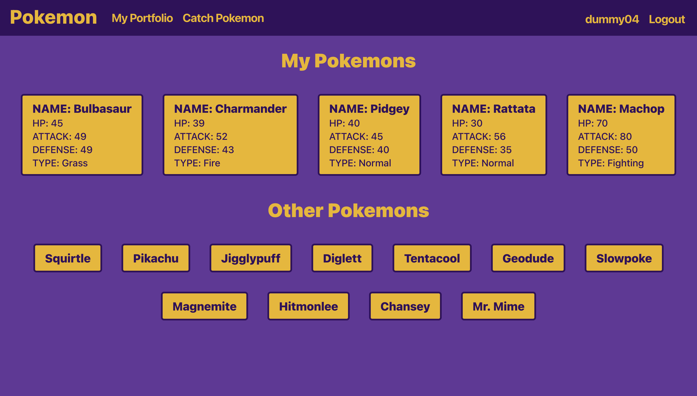
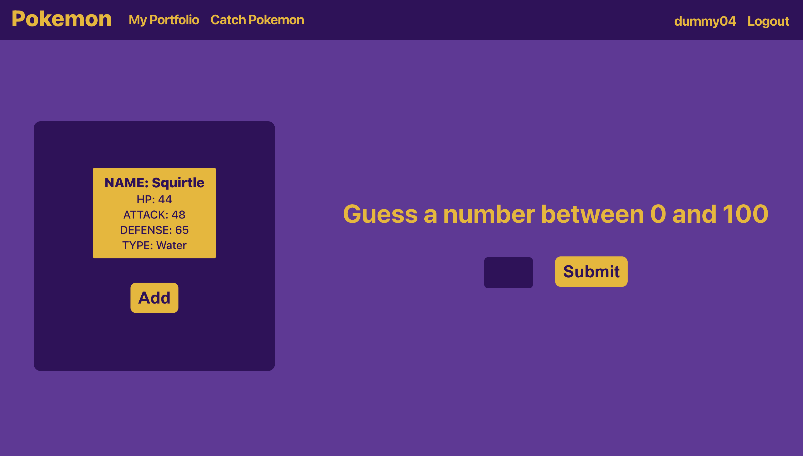
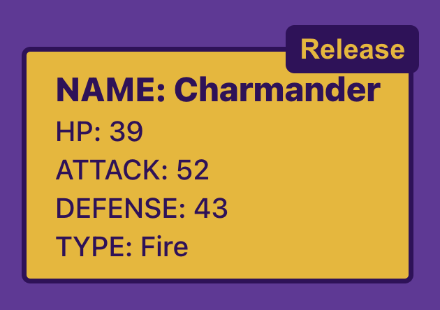
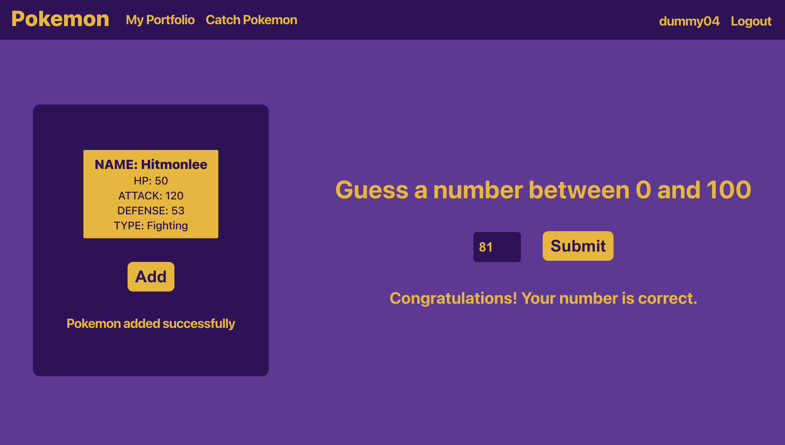
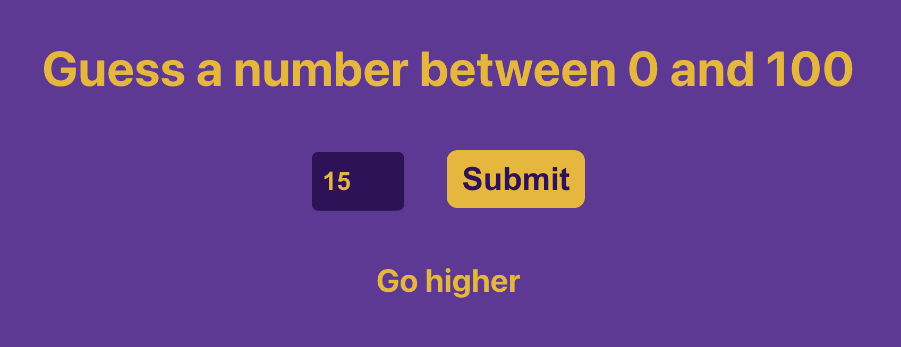
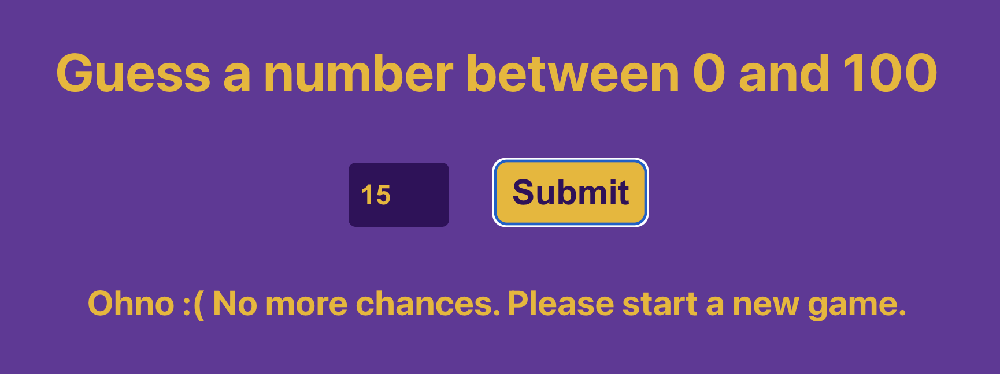
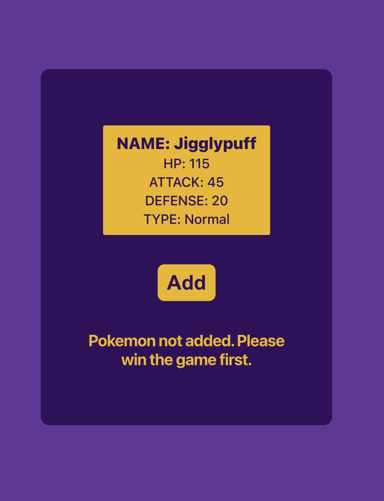

# Pokemon Project

A full stack web application that allows users to view their captured pokemons and catch unowned pokemon by winning a simple game.

## Login Page

## Portfolio Page

## Catch Pokemon Page

## Functions

### **User Login**

### **User Registration** 

### **Release Pokemon**

### **Number Guessing game**

